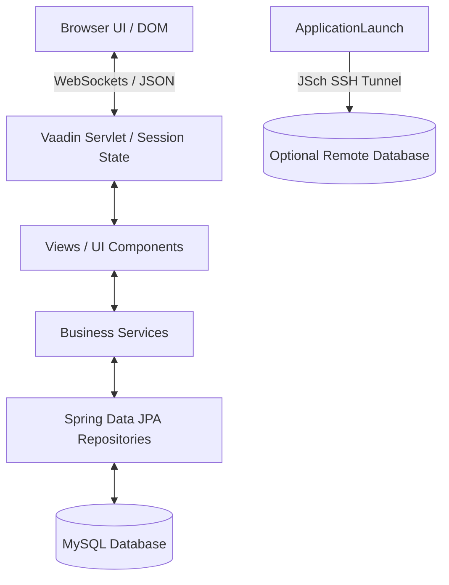
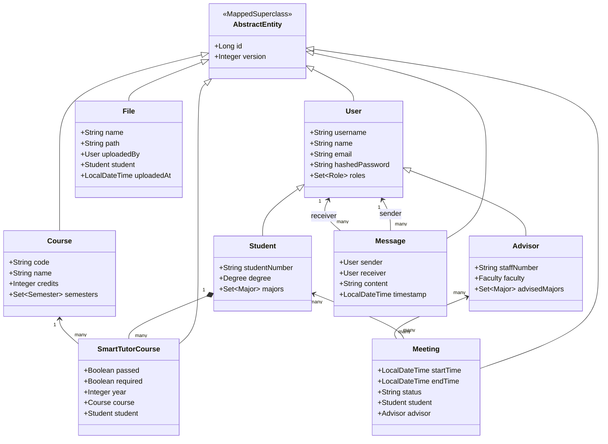

# Software Architecture Document: MyAdvisor

This document details the high-level system design, data architecture, security model, and key workflow implementations of **MyAdvisor**. 

---

## 🗺️ High-Level System Overview

MyAdvisor uses a stateful server-side rendering architecture powered by **Vaadin Flow** on top of **Spring Boot**. 

Unlike typical stateless REST APIs with decoupled Single Page Applications (SPAs), Vaadin Flow maintains a component state tree on the server side and automatically syncs UI updates to the browser DOM via a secure WebSockets/COMET connection.



---

## 📦 Package & Directory Structure

The backend code is organized under `uct.myadvisor`:

```text
uct.myadvisor/
├── Application.java          # Spring Boot Entry Point & SSH Tunnel Trigger
├── data/                    # JPA Entities & Repository Interfaces
│   ├── AbstractEntity.java  # Mapped Superclass (ID and Version tracking)
│   ├── User.java            # Single-Table Inheritance Parent for users
│   ├── Student.java         # Student user details and major relations
│   ├── Advisor.java         # Advisor user details and meeting schedules
│   ├── Course.java          # Courses, credits, and prerequisites
│   └── *Repository.java     # Spring Data JPA Repository classes
├── security/                # Spring Security Configurations & SSH Helper
│   ├── SecurityConfiguration.java
│   └── SshTunnel.java
├── services/                # Business services orchestrating database logic
│   ├── ChatService.java     # Reactor-based real-time chat dispatcher
│   ├── UserService.java     # User mapping & query services
│   └── *Service.java        # Entity CRUD services
└── views/                   # Vaadin Flow View controllers
    ├── MainLayout.java      # Application wrapper and side navigation drawer
    ├── login/               # Vaadin LoginForm integration
    ├── smartTutor/          # Smart Tutor tracking grids
    └── *View.java           # Views mapped by routes and role permissions
```

---

## 💾 Data Model Summary

The database uses a relational schema managed through JPA annotations. The user table utilizes Single Table Inheritance for polymorphic user entities.



---

## 🔒 Authentication & Authorization Approach

The application uses **Spring Security** integrated with Vaadin Flow's Web Security configurer:

1. **User Storage:** Spring Security hooks into `UserDetailsServiceImpl`, which queries the custom `UserRepository` in the MySQL database to look up accounts.
2. **Password Hashing:** Enforced using a standard `BCryptPasswordEncoder` configured bean.
3. **Route Protection:** Handled declaratively via Vaadin's `@RolesAllowed` decorator on View classes. Vaadin intercepts routing requests and blocks rendering if the authenticated user session does not hold the required `Role` authority.
4. **Current User Utility:** Mapped using `AuthenticatedUser` helper to query Spring's `SecurityContextHolder` reactively within views.

---

## 🔄 Core Workflows

### 1. Login & Registration
- Users access `LoginView` (publicly accessible). Submission verifies credentials against Spring Security's context.
- Registration uses Vaadin `Binder` validation to ensure username uniqueness, email structure compliance, and matching passwords before saving a new `User` entity to the database.

### 2. Meeting Booking
- **Advisors** publish available meeting slots by creating `Meeting` instances marked with a `FREE` status.
- **Students** navigate to `MeetingsView` where they filter slots by advisors representing their major.
- Selecting a slot updates the `Meeting` entity state: assigns the `Student` relationship, marks the status as `REQUESTED` / `BOOKED`, and triggers notifications.

### 3. File Upload
- Implemented using Vaadin's `Upload` component tied to `MultiFileMemoryBuffer`.
- On successful upload, a `File` entity is persisted in the database storing metadata (uploader, time, student target).
- The file itself is transferred from memory to a local folder on disk: `System.getProperty("user.dir") + "/target/files/{uploaderId}/{fileName}"`.
- **Security Check:** File deletion checks ownership. Users can only delete files they originally uploaded.

### 4. Real-Time Chat (Reactive Streams)
The chat architecture is built using reactive programming constructs:
- `ChatService` exposes a **Project Reactor** `Sinks.Many` multicast sink representing all in-flight messages.
- When `ChatService.add(sender, receiver, text)` is triggered, the message is stored in the DB, and emitted into the sink.
- Views subscribe to a `Flux` stream filtering messages specific to the active conversation pairs. Vaadin's `@Push` annotation reactively pushes UI list updates down to client browsers in real time without polling.

### 5. Smart Tutor (Degree Tracking)
- First-time student logins display a welcome dialog prompting them to select their `Degree` and target `Majors`.
- `CourseService.addCoursesForStudentMajors()` queries curriculum configurations, pulls all **Required Courses**, and maps them as `SmartTutorCourse` records assigned to the student.
- The `SmartTutorView` loads these courses into a grid displaying total credits, requirement status, and passed/failed checkboxes.
- Students can browse the course catalog to add optional **Elective Courses** to their planner grid to simulate degree completion.

---

## ⚠️ Notable Design Tradeoffs

### Stateful UI vs. Stateless REST
- *Tradeoff:* Maintaining UI state on the server allows fast development in pure Java without REST controller overhead. However, it increases server memory consumption and requires sticky session routing to scale.
- *Capstone Context:* This was an ideal trade-off for a team project targeting a single-server deployment.

### File Storage location
- *Tradeoff:* Files are written to `/target/files/`.
- *Capstone Context:* This was selected for simplicity to avoid external cloud dependencies or complex local folder paths during grading. The drawback is that clean builds (`mvn clean`) delete uploaded assets.

### Testing Coverage
- *Tradeoff:* Minimal unit testing structure.
- *Capstone Context:* Project prioritized rapid feature development (Chat, Smart Tutor, Booking Engine) under Capstone course time constraints over robust coverage.

---

## 🔮 Future Improvements

1. **S3/Cloud File Storage Adapter:** Refactor `FileService` to use an interface (e.g. `StorageClient`) that saves files to Amazon S3 or Google Cloud Storage in production.
2. **Database Query Profiling:** Add indexes to key columns: `application_user(role)`, `smart_tutor_courses(student_id)`, and `files(student_id)`.
3. **Containerized Deployments:** Package application into a Docker container with configurations reading environment variables natively.
4. **Integration Testing:** Write integration tests using Spring Boot's test profile backed by an in-memory H2 database.
